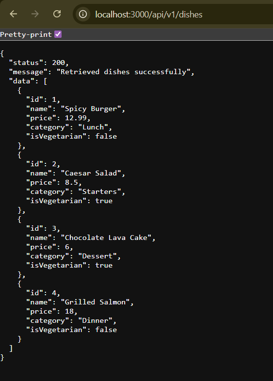

# RESTful API Activity - John Lorenz Mira

## Best Practices Implementation

### 1. Environment Variables
**Why did we put `BASE_URI` in `.env` instead of hardcoding it?**

**Answer:**  
We put `BASE_URI` in the `.env` file to avoid hardcoding values directly in the source code. This makes the application easier to configure for different environments and improves security by keeping configuration values separate from the code.

---

### 2. Resource Modeling
**Why did we use plural nouns (e.g., `/dishes`) for our routes?**

**Answer:**  
Plural nouns are used to represent a collection of resources in a RESTful API. Using `/dishes` clearly shows that the endpoint handles multiple dish records and follows standard REST API conventions, making the API easier to understand and maintain.

---

### 3. Status Codes
**When do we use `201 Created` vs `200 OK`?**

**Answer:**  
`201 Created` is used when a new resource is successfully created, such as adding a new dish using a POST request.  
`200 OK` is used when a request is successful but does not create a new resource, such as retrieving, updating, or deleting data.

**Why is it important to return `404` instead of just an empty array or a generic error?**

**Answer:**  
Returning `404 Not Found` clearly tells the client that the requested resource does not exist. This helps with proper error handling and avoids confusion that could happen if only an empty response or generic error is returned.

---

### 4. Testing
*(Paste a screenshot of a successful GET request here)*

