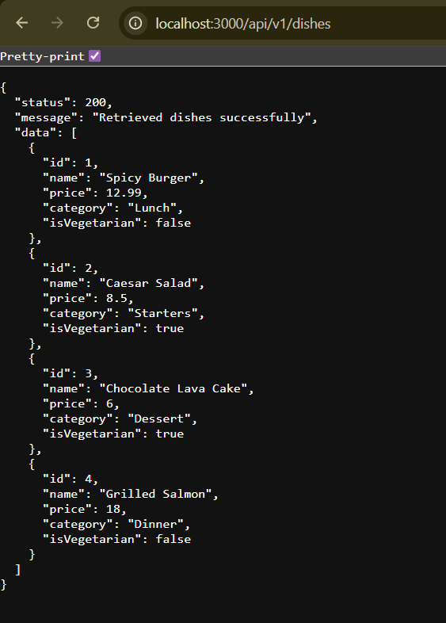

# RESTful API Activity - John Lorenz Mira

## Best Practices Implementation

### 1. Environment Variables
**Why did we put `BASE_URI` in `.env` instead of hardcoding it?**

**Answer:**  
We put `BASE_URI` in the `.env` file to avoid hardcoding values directly in the source code. This makes the application easier to configure for different environments and improves security by keeping configuration values separate from the code.

---

### 2. Resource Modeling
**Why did we use plural nouns (e.g., `/dishes`) for our routes?**

**Answer:**  
Plural nouns are used to represent a collection of resources in a RESTful API. Using `/dishes` clearly shows that the endpoint handles multiple dish records and follows standard REST API conventions, making the API easier to understand and maintain.

---

### 3. Status Codes
**When do we use `201 Created` vs `200 OK`?**

**Answer:**  
`201 Created` is used when a new resource is successfully created, such as adding a new dish using a POST request.  
`200 OK` is used when a request is successful but does not create a new resource, such as retrieving, updating, or deleting data.

**Why is it important to return `404` instead of just an empty array or a generic error?**

**Answer:**  
Returning `404 Not Found` clearly tells the client that the requested resource does not exist. This helps with proper error handling and avoids confusion that could happen if only an empty response or generic error is returned.

---

### 4. Testing
*(Paste a screenshot of a successful GET request here)*

**Why did I choose to Embed the Maintenance Log?**

**Answer:**
Maintenance logs belong only to a specific room and are always accessed together with the room details. Embedding allows faster reads, simpler queries, and avoids unnecessary collections for small, room-specific data.

**Why did I choose to Reference the Room and Guest in Booking?**

**Answer**
Rooms and guests are independent entities that can exist without a booking and may be associated with multiple bookings over time. Referencing avoids data duplication and maintains data consistency across the system.

### Securing API

*1.Authentication vs Authorization: What is the difference between Authentication and Authorization in our code?*

**Answer:**
Authentication is the process of checking if the user is really who they claim to be. In our code, this happens when the system verifies the user’s email and password before giving them a JWT token.

Authorization happens after authentication. It checks what the authenticated user is allowed to do in the system, such as accessing certain routes or performing specific actions based on their role.

*2. Security (bcrypt): Why did we use bcryptjs instead of saving passwords as plain text in MongoDB?*

**Answer:**
We used bcryptjs to protect user passwords. If passwords were saved as plain text in the database, anyone who gained access to the database could easily read them.

bcryptjs converts the password into a hashed version, which means it becomes unreadable. This makes the stored password much safer even if the database is compromised.

*3. JWT Structure: What does the protect middleware do when it receives a JWT from the client?*

**Answer:**
The protect middleware checks the JWT sent by the client to make sure it is valid. If the token is correct, it reads the information inside it and identifies the user who made the request. Then it attaches that user’s data to the request so the system knows who is accessing the route.

If the token is missing or invalid, the middleware stops the request and returns a 401 Unauthorized error.